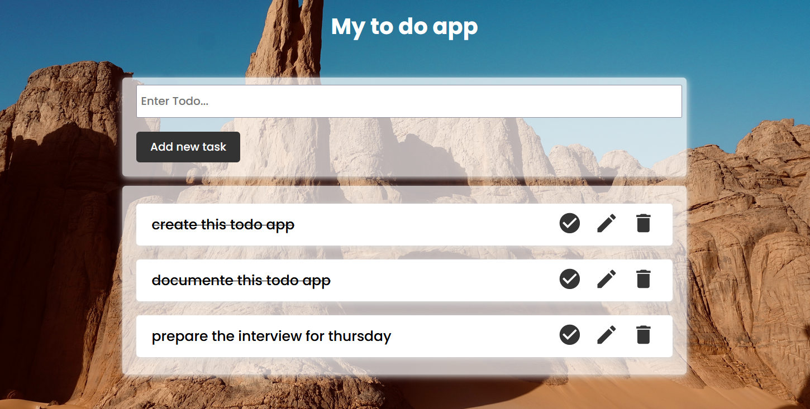

# To-Do App

Cette application vous permet de créer des listes de tâches à effectuer et de les marquer comme terminées lorsque vous les avez terminées. Les données sont stockées sur Firebase, ce qui vous permet de accéder à vos listes depuis n'importe quel appareil.

## Technologies utilisées

    React: pour construire l'interface utilisateur
    Firebase: pour stocker les données
    Material-UI: pour la mise en page et les styles

## Fonctionnalités CRUD

L'application utilise Firebase pour stocker les données des tâches, qui sont organisées en listes. Pour chaque liste, il est possible de créer, lire, mettre à jour et supprimer des tâches.

CREATE

Pour créer une tâche, il suffit de saisir le nom de la tâche dans le champ de saisie en haut de la page et de cliquer sur "Ajouter". La tâche sera ajoutée à la liste en cours d'affichage et sera automatiquement stockée sur Firebase.

READ

Toutes les tâches d'une liste sont affichées sur la page d'accueil de l'application. Les tâches terminées sont affichées en grisées et les tâches en cours d'exécution sont affichées en noir.

UPDATE

Pour marquer une tâche comme terminée, il suffit de cliquer sur la case à cocher à gauche du nom de la tâche. Cela mettra à jour l'état de la tâche sur Firebase.

DELETE

Pour supprimer une tâche, il suffit de cliquer sur le bouton "Supprimer" à droite du nom de la tâche. Cela supprimera la tâche de la liste en cours d'affichage et de Firebase.